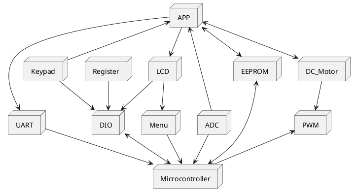
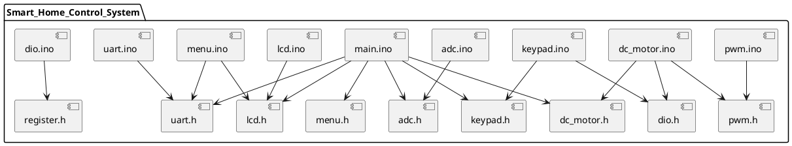

# Smart Home Control System Design

| **Author**              | `Seif Salama, Malik Babiker, Mostafa Hatem`                                       |
|:------------------------|:-----------------------------------------------------|
| **Status**              | `Draft/Inspection/Approved`                          |
| **Version**             | `1.0`                                                |
| **Date**                | `09/12/2024`                                         |

## Introduction

This report outlines the design and low-level implementation of a Smart Home Control System, which monitors temperature and light intensity through analog sensors and controls a fan driven by a DC motor. The system dynamically adjusts fan speed and direction based on sensor readings and user input. Configuration settings, including fan speed and rotation direction, are accessible and adjustable via keypad input. The design is implemented using native C programming, avoiding Arduino-based code or pre-developed libraries to ensure a customized, lightweight, and efficient solution.

### Purpose
The purpose of this specification is to outline the internal structure, functional components, and embedded constraints for implementing the Smart Home Control System, forming the basis for coding and module testing.

### Scope
The scope of this document includes:

- Design and implementation of the Smart Home system.
- Integration of analog sensors, Temperature sensor and LDR, and display of their values on an LCD screen.
- User-configurable settings via keypad input.
- Alert mechanism to notify the user when sensor readings exceed the defined limits.

This document serves as the reference for both coding and module testing, ensuring that the system works within the defined constraints and meets the project requirements.

The module priority is classified as P2, indicating that it is a necessary part of the system but not critical for initial deployment.

### Defnitions and Acronym
| **Abbreviation** |             **Meaning**             |
|:----------------:|:-----------------------------------:|
| ADC              | Analog-to-Digital Converter              |
| UART             | Universal Asynchronous Receiver Transmitter |
| LCD              | Liquid Crystal Display                  |
| POT              | Potentiometer                            |
| LDR              | Light Dependent Resistor                |
| DIO              | Digital Input Output                |
| LED              | Light Emitting Diode                |
| DC               | Direct Current                      |
| PWM              | Pulse Width Modulation              |


## Architectural Overview

This section describes where this module resides in the context of the embedded system's software architecture


### Assumptions & Constraints

1. This system assumes stable input from sensors, using averaging to reduce noise.
2. The LCD display has limited character space, requiring concise data representation.
3. The module operates within the 8-bit MCU memory constraints and processing capacity.
4. The system assumes that all connected components (sensors, motor, etc.) are properly calibrated and function within the expected range.
5. The system assumes that the user interacts with the system through a keypad and LCD, and no additional input devices are required.

@startuml
(*) --> Init
Init --> ConfigureADC_UART_LCD
ConfigureADC_UART_LCD --> AwaitKeyInput
AwaitKeyInput --> SetChannel
SetChannel --> If "Key = 1" then
    If --> DisplayTempValue
    DisplayTempValue --> AwaitKeyInput
    AwaitKeyInput --> If "Key = 1" then
        If --> ControlFanSpeedDirection
        ControlFanSpeedDirection --> AwaitKeyInput
    else
        If --> ControlTemperature
        ControlTemperature --> AwaitKeyInput
    endif
else if "Key = 2" then
    If --> DisplayLDRValue
    DisplayLDRValue --> AwaitKeyInput
    AwaitKeyInput --> If "Key = 1" then
        If --> ControlLEDIntensity
        ControlLEDIntensity --> AwaitKeyInput
    endif
else
    If --> AwaitKeyInput
endif
@enduml


## Functional Description
The Smart Home Control System integrates temperature control with fan simulation and smart lighting with LED control. It reads temperature and light intensity data from sensors, displays values on an LCD, and adjusts fan speed and direction based on the desired temperature set by the user. LED brightness is controlled by light intensity. The user can set the desired temperature via a keypad, and real-time data is transmitted via UART for external monitoring, providing a responsive smart home experience.

## Implementation of the Module
This chapter discusses the detailed design of the Smart Home Control System, which consists of two main parts.

Temperature Control System (Fan Simulation):

- Temperature Sensor: This part of the system uses an ADC to read the temperature values from a sensor. The temperature is then displayed on the LCD. The fan speed 
  and direction can be controlled based on the temperature readings.
- Fan Speed and Direction Control: The fan simulates an air conditioning system. The fan's speed and direction (clockwise or counterclockwise) are adjusted based on 
  the temperature sensor's reading. The user can set the temperature via the keypad, and this value determine when the fan will start and stop operating.

Smart Lighting System (LDR Sensor and LED):

- LDR (Light Dependent Resistor) Sensor: This sensor is used to monitor the surrounding light intensity. The LDR sensor is connected to the ADC, and its readings 
  are displayed on the LCD.
- LED Control: The LED simulates the smart lighting system, and its brightness is adjusted based on the light intensity measured by the LDR. The LED's brightness can 
  be controlled to match desired lighting levels based on the sensor's readings.

## Integration and Configuration
### Static Files

```
| File name     | Contents                             |
|---------------|--------------------------------------|
| main.ino      | Source code for main application     |
| dio.ino       | Source code for DIO functions        |
| dio.h         | Header file for DIO functions        |
| uart.ino      | Source code for UART functions       |
| uart.h        | Header file for UART functions       |
| adc.ino       | Source code for ADC functions        |
| adc.h         | Header file for ADC functions        |
| Lcd.ino       | Source code for LCD functions        |
| Lcd.h         | Header file for LCD functions        |
| keypad.ino    | Source code for Keypad functions     |
| keypad.h      | Header file for Keypad functions     |
| pwm.ino       | Source code for PWM functions        |
| pwm.h         | Header file for PWM functions        |
| menu.ino      | Source code for menu display         |
| menu.h        | Header file for menu display         |
| dc_motor.ino  | Source code for DC Motor functions   |
| dc_motor.h    | Header file for DC Motor functions   |
| eeprom.ino    | Source code for EEPROM functions     |
| eeprom.h      | Header file for EEPROM functions     |
| servo.ino     | Source code for Servo Motor functions|
| servo.h       | Header file for Servo Motor functions|

```


### Include Structure

The following diagram shows dependencies upon files in the module.



### Configuration
Any required hardware/software or system configuration that can be adjusted a header file shall be detailed in this section. This can be placed in the table below.
| Name      | Value Range  | Description                                    |
|-----------|--------------|------------------------------------------------|
| SPEED     | 0 - 1023     | Speed control value for the fan                |
| Direction | 0 - 1        | Direction control for the fan (0: CW, 1: CCW)  |
| TEMP      | 0 - 1023     | Temperature sensor reading range               |
| SAMPLES   | 20           | Number of samples for averaging sensor data    |
